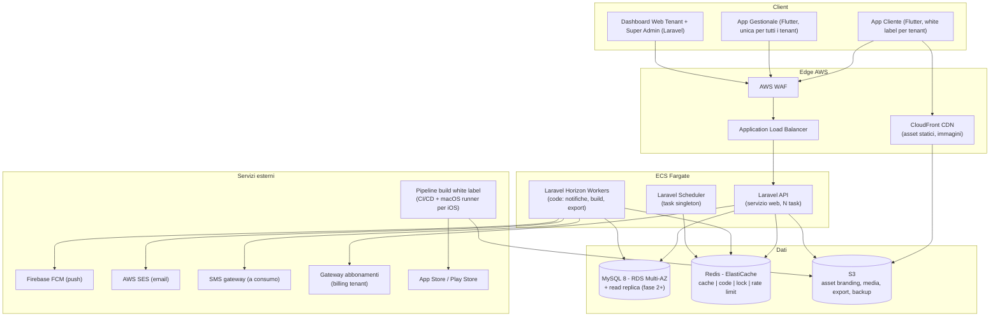

# 21 — Architettura Generale

## 1. Stack tecnologico (vincolato)

| Livello | Tecnologia | Ruolo |
|---|---|---|
| Mobile | **Flutter** (Dart) | App cliente finale white label + app gestionale staff/tenant |
| Backend | **Laravel** (PHP 8.3+) | API REST, dashboard web, job asincroni, scheduler |
| Database | **MySQL 8** (Amazon RDS/Aurora MySQL) | Dati transazionali multi-tenant |
| Cache/Code | **Redis** (Amazon ElastiCache) | Cache, sessioni, code Laravel Horizon, lock distribuiti, rate limiting |
| Storage | **Amazon S3** + CloudFront | Asset di branding, immagini servizi, export, artefatti build |
| Push | **Firebase Cloud Messaging** | Notifiche push iOS/Android |
| Hosting | **AWS** | ECS Fargate, RDS, ElastiCache, S3, CloudFront, SES, ALB, WAF |

## 2. Vista d'insieme

## 3. Scelte architetturali fondanti

### 3.1 Monolite modulare (non microservizi)
Un'unica applicazione Laravel organizzata in moduli a confini netti (vedi [23-ddd-clean-architecture.md](23-ddd-clean-architecture.md)). Motivazioni:
- Team iniziale piccolo: i microservizi moltiplicano i costi operativi senza beneficio sotto i ~50 sviluppatori
- Le transazioni critiche (prenotazione atomica) sono molto più semplici in un singolo database
- I confini modulari DDD permettono un'eventuale estrazione futura di servizi (es. Notification Engine) senza riscrittura

### 3.2 Tre superfici client, una sola white label
| Superficie | Tecnologia | Branding | Distribuzione |
|---|---|---|---|
| App Cliente Finale | Flutter | **White label per tenant** (icona, nome, splash compilati; tema/contenuti runtime) | Store per tenant (vedi [27](27-white-label-tecnico.md)) |
| App Gestionale (Tenant Admin + Operatori) | Flutter (stessa codebase, target separato) | Brand piattaforma, unica per tutti | Un'unica app per store |
| Dashboard Web (Tenant Admin + Super Admin) | Laravel (server-rendered + componenti interattivi) | Tema per tenant via CSS variables | Web, sottodominio per tenant |

Razionale: la superficie white label (quella che giustifica i 990€+250€/mese) è solo l'app cliente; moltiplicare le build per le superfici gestionali non aggiunge valore percepito e raddoppia i costi.

### 3.3 Thin shell + configurazione remota
La build per-tenant dell'app cliente contiene **solo ciò che gli store obbligano a compilare**: bundle id, nome app, icona, splash. Tema colori, logo in-app, testi, catalogo, feature flag arrivano dall'API a runtime (con cache locale). Conseguenza: la quasi totalità delle personalizzazioni da dashboard è effettiva in minuti, senza nuove submission.

### 3.4 Asincronicità sistematica
Tutto ciò che non è necessario alla risposta HTTP è un job in coda (Redis + Horizon): invio notifiche, email, generazione export, generazione asset, trigger build, sincronizzazioni billing. Code separate per priorità: `critical` (conferme prenotazione), `default`, `bulk` (campagne broadcast), `builds`.

## 4. Ambienti

| Ambiente | Scopo | Infrastruttura |
|---|---|---|
| `dev` | Sviluppo, CI | Docker compose locale + ambiente condiviso minimo |
| `staging` | Pre-produzione, identica a prod in piccolo; tenant sintetici + tenant "canary" interno | Stack AWS ridotto (single-AZ) |
| `production` | Esercizio | Stack completo Multi-AZ |

Politica: nessun dato personale reale in dev/staging (dataset sintetico o anonimizzato).

## 5. Networking e sicurezza perimetrale

- VPC dedicata; subnet pubbliche solo per ALB/NAT; ECS, RDS, ElastiCache in subnet private
- Security group a privilegio minimo (RDS accetta solo da ECS; Redis solo da ECS)
- WAF su ALB: regole gestite (SQLi/XSS), rate limit IP, blocco bot
- TLS terminato su ALB (certificati ACM); HSTS; TLS anche verso RDS/Redis (in transit encryption)
- Accesso amministrativo: SSM Session Manager (nessun bastion SSH esposto)

## 6. Flusso di una richiesta tipo (prenotazione)

1. App Flutter chiama `POST /api/v1/appointments` con JWT
2. WAF → ALB → task ECS Laravel
3. Middleware: autenticazione JWT → risoluzione tenant (claim `tid`) → binding TenantContext → rate limiting (Redis) → autorizzazione (policy RBAC)
4. Use case `CreateAppointment`: transazione MySQL con verifica disponibilità e vincolo di unicità slot ([30-engine-appuntamenti.md](30-engine-appuntamenti.md))
5. Eventi di dominio → job in coda: notifica conferma (FCM/SES), scheduling promemoria, invalidazione cache disponibilità
6. Risposta 201 con risorsa appuntamento

## 7. Pipeline CI/CD

### Backend Laravel
- Push → test (unit, feature, suite isolamento multi-tenant RNF-21) → static analysis → build immagine container → deploy staging → smoke test → deploy production rolling su ECS (zero downtime)

### App Flutter (core)
- Push → test/analyze → build dei due target (cliente generico per QA, gestionale) → distribuzione interna (TestFlight/Internal testing) → release programmata

### Build white label per-tenant
- Pipeline parametrica separata, trigger da evento di provisioning/aggiornamento: genera configurazione nativa da tenant registry → build → firma → upload store / consegna artefatto ([27-white-label-tecnico.md](27-white-label-tecnico.md) §3); runner macOS per build iOS

## 8. Decisioni rinviate consapevolmente (con trigger)

| Decisione | Trigger di riapertura |
|---|---|
| Read replica MySQL | p95 query read > soglia o CPU RDS > 60% sostenuta |
| Aurora MySQL al posto di RDS MySQL | necessità di failover < 30s o storage > 1 TB |
| Estrazione Notification Engine in servizio dedicato | throughput notifiche > capacità worker pool con costi anomali |
| Sharding per fasce di tenant | vedi criteri in [13-strategia-scalabilita.md](13-strategia-scalabilita.md) e [32-qualita-aws.md](32-qualita-aws.md) |
| Multi-regione | espansione geografica con requisiti di latenza/residency |
