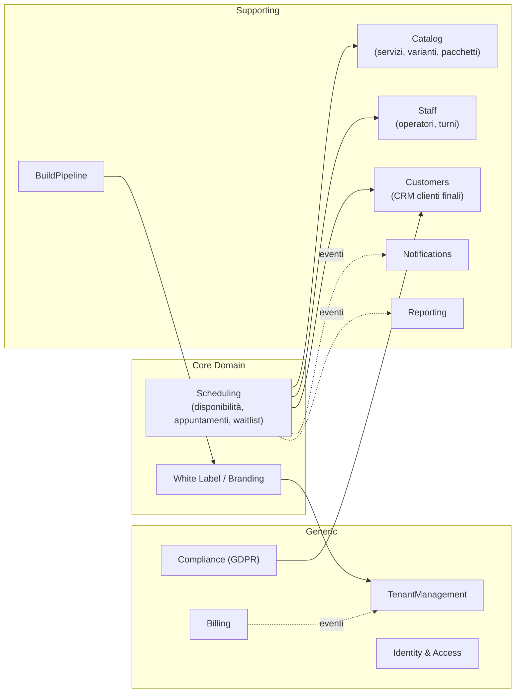

# 23 — Domain Driven Design e Clean Architecture

## 1. Bounded Context

**Scheduling è il core domain**: è dove la piattaforma vince o perde (correttezza degli slot, zero doppie prenotazioni). White Label/Branding è il secondo core: è la proposta di valore commerciale. Tutto il resto è supporting o generic (candidabile a soluzioni standard: Billing su gateway esterno, IAM su componenti Laravel consolidati).

## 2. Ubiquitous Language (glossario vincolante)

| Termine | Definizione | Note |
|---|---|---|
| **Tenant** | Il cliente della piattaforma (attività/professionista) | Mai "cliente" da solo |
| **Customer** | Il cliente finale del tenant, utente dell'app | Mai "utente" generico |
| **Staff Member** | Operatore del tenant che eroga servizi | Include il titolare se eroga servizi |
| **Service** | Prestazione prenotabile con durata e prezzo | Con eventuali **Variant** |
| **Appointment** | Prenotazione confermata o richiesta, con uno o più **Appointment Item** (servizio × operatore × intervallo) | |
| **Slot** | Intervallo di inizio proponibile, derivato — mai persistito come entità | Calcolato dall'Availability Engine |
| **Schedule** | Regole ricorrenti di disponibilità (sede o staff member), in ora locale | |
| **Schedule Exception** | Deroga puntuale (chiusura, ferie, apertura straordinaria) | |
| **Brand Profile** | L'insieme degli asset e parametri white label di un tenant | |
| **Build** | Artefatto applicativo generato per un tenant | Con ciclo di vita di pubblicazione |
| **Plan / Subscription** | Piano commerciale e abbonamento attivo del tenant | Determina i feature flag |

## 3. Aggregati principali (context Scheduling)

| Aggregato | Root | Contenuto | Invarianti protette |
|---|---|---|---|
| **Appointment** | Appointment | AppointmentItems, stato, riferimenti customer/location, snapshot prezzi | Gli item non si sovrappongono per lo stesso staff member; transizioni di stato lecite; totale = somma item |
| **Schedule** | StaffSchedule / LocationSchedule | Regole settimanali + eccezioni | Intervalli validi, non sovrapposti per giorno |
| **WaitlistEntry** | WaitlistEntry | Preferenze (servizio, intervallo, staff) | Un'iscrizione attiva per customer/servizio/intervallo |

La **disponibilità non è un aggregato**: è una *read model* calcolata (e cacheata) a partire da Schedule + Appointment + Exception. Questo evita di persistere slot e di doverli sincronizzare.

### Eventi di dominio (selezione)

| Evento | Pubblicato da | Consumatori |
|---|---|---|
| `AppointmentBooked` | Scheduling | Notifications (conferma + scheduling promemoria), Reporting, cache invalidation |
| `AppointmentCancelled` | Scheduling | Notifications, Waitlist (offerta slot), Reporting |
| `AppointmentRescheduled` | Scheduling | Notifications (re-scheduling promemoria) |
| `AppointmentMarkedNoShow` | Scheduling | Reporting, CRM (storico no-show, RF-52) |
| `StaffUnavailabilityDeclared` | Staff | Scheduling (identificazione appuntamenti impattati → Flusso 5) |
| `BrandProfileUpdated` | Branding | BuildPipeline (valuta se serve rebuild o solo config runtime), cache config |
| `TenantSuspended` / `TenantReactivated` | TenantManagement | IAM (blocco accessi), app config endpoint |
| `SubscriptionPaymentFailed` | Billing | TenantManagement (macchina a stati Flusso 9) |

## 4. Clean Architecture — Backend Laravel

Struttura per modulo (vedi [22-struttura-repository.md](22-struttura-repository.md)):

| Layer | Contenuto | Regola di dipendenza |
|---|---|---|
| **Domain** | Entità, value object (TimeSlot, Money, TimeZoneId), eventi, interfacce repository, servizi di dominio (AvailabilityCalculator) | Non dipende da nulla: no Laravel, no Eloquent |
| **Application** | Use case (BookAppointment, ConfigureBrandProfile…), DTO, port verso servizi esterni | Dipende solo da Domain |
| **Infrastructure** | Eloquent model + mapping, repository concreti, client FCM/SES/S3/gateway, cache | Implementa interfacce di Domain/Application |
| **Presentation** | Controller API/web, FormRequest (validazione), API Resource (serializzazione), policy authorization | Invoca solo Application |

Compromesso pragmatico dichiarato: per i moduli CRUD a bassa logica (Catalog, Customers) è ammesso l'uso diretto di Eloquent nei use case, documentato come deroga; per **Scheduling e Billing** la separazione Domain/Infrastructure è obbligatoria (è dove vivono le invarianti critiche e i test unitari puri).

## 5. Clean Architecture — Flutter

| Layer | Contenuto |
|---|---|
| **Domain** (`core_domain` + feature/domain) | Entità immutabili, use case, repository astratti |
| **Data** (feature/data) | Repository concreti: `api_client` + cache locale (ultimi dati noti); mapping DTO↔entità |
| **Presentation** (feature/presentation) | State management a stati espliciti (loading/success/failure), pagine, widget del design system |

Regole specifiche del progetto:
- Il **tema non è hardcoded**: ogni widget consuma il tema fornito da `white_label` (caricato a runtime, vedi [27-white-label-tecnico.md](27-white-label-tecnico.md) §4)
- Le feature flag arrivano dal config endpoint e gateano le route/sezioni in `app/`
- Nessuna logica di disponibilità nel client: il calcolo slot è solo backend; il client mostra ciò che l'API restituisce (evita divergenze e cheating)

## 6. Strategia offline (app cliente)

- **Lettura**: cache locale dei dati propri (prossimi appuntamenti, catalogo, config brand) con timestamp; l'app è consultabile offline in sola lettura con indicatore di staleness
- **Scrittura**: nessuna coda offline per le prenotazioni (uno slot non può essere garantito offline); il client gestisce retry con `Idempotency-Key` ([25-api-rest.md](25-api-rest.md) §6) solo per richieste già avviate su rete instabile
- L'app gestionale segue lo stesso principio: l'agenda di oggi è cacheata, le modifiche richiedono rete

## 7. Mappa moduli applicativi → bounded context

| Modulo (Fase 1, doc 09) | Bounded context Fase 2 | Note |
|---|---|---|
| A1 Tenant Management | TenantManagement | |
| A2 Billing & Subscription | Billing | Gateway esterno per ricorrenze |
| A3 Monitoring & Analytics | Reporting + observability infrastrutturale ([32](32-qualita-aws.md)) | |
| A4 Build & Release | BuildPipeline | Orchestrazione; l'esecuzione è in platform-infra |
| A5 Supporto | fuori scope tecnico iniziale: strumento SaaS esterno integrato | decisione: non costruire un ticketing |
| B1 Branding | Branding | |
| B2 Anagrafica attività | TenantManagement (locations) | |
| B3 Catalogo servizi | Catalog | |
| B4 Operatori | Staff | |
| B5 Orari/calendario | Scheduling | |
| B6 Notifiche | Notifications | |
| B7 CRM | Customers | |
| B8 Reportistica | Reporting | |
| C1-C5 App cliente | feature Flutter sui medesimi context | |
| D1 IAM | Foundation/Auth + IAM | |
| D2 Multi-tenancy core | Foundation/Tenancy | |
| D5 Audit & Compliance | Compliance + Foundation/Audit | |
