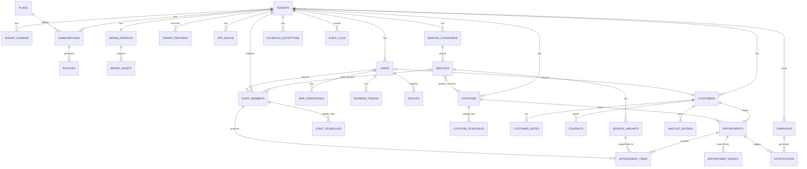

# 24 — Progettazione Database (MySQL 8) e ER Diagram

## 1. Principi

- **Singolo database condiviso**, colonna `tenant_id BIGINT UNSIGNED` su ogni tabella tenant-bound, sempre indicizzata come **prima colonna degli indici composti**
- Charset `utf8mb4`; engine InnoDB; chiavi primarie `BIGINT UNSIGNED AUTO_INCREMENT` interne + `uuid` (BINARY(16)) esposto nelle API (mai esporre id sequenziali cross-tenant)
- **Istanti** (appuntamenti, timestamp) in UTC (`DATETIME`); **regole ricorrenti** (orari) in ora locale + colonna timezone IANA sulla sede
- Soft delete (`deleted_at`) sulle entità referenziate da storico: services, staff_members, locations, customers
- Snapshot denormalizzati sugli appointment item (nome servizio, prezzo, durata al momento della prenotazione): lo storico non cambia se il listino cambia
- Cifratura a livello applicativo (Laravel encrypted casts) per colonne sensibili: note cliniche, MFA secret, token

## 2. ER Diagram

## 3. Schema relazionale — tabelle di piattaforma

### `tenants`
| Colonna | Tipo | Note |
|---|---|---|
| id | BIGINT UNSIGNED PK | |
| uuid | BINARY(16) UNIQUE | esposto nelle API |
| legal_name, display_name | VARCHAR | |
| sector | ENUM(barber, hair, beauty, dental, medical, physio, consultant, other) | guida compliance (sanitario) |
| status | ENUM(onboarding, active, at_risk, suspended, terminated) | macchina a stati Flusso 9 |
| default_timezone | VARCHAR(64) | IANA, default sedi |
| default_locale | VARCHAR(10) | |
| onboarding_state | JSON | checklist wizard (KPI attivazione) |
| billing_* | VARCHAR | dati fatturazione |
| health_data_enabled | BOOLEAN | modulo dati sanitari (obbligatorio se sector sanitario) |
| created_at / updated_at / suspended_at / terminated_at | DATETIME | |

### `tenant_domains`
tenant_id FK, domain VARCHAR UNIQUE (sottodominio dashboard), is_primary. Indice UNIQUE(domain).

### `plans`, `subscriptions`, `invoices`, `tenant_features`
- `plans`: code (base, pro, enterprise), price_monthly, features JSON (flag di default), quotas JSON (max staff, sedi, broadcast/mese)
- `subscriptions`: tenant_id, plan_id, status (trialing, active, past_due, suspended, cancelled), gateway_subscription_id, current_period_end. Stato sincronizzato via webhook gateway
- `invoices`: subscription_id, amount, vat, status, gateway_invoice_id, issued_at, paid_at
- `tenant_features`: tenant_id, feature_code, enabled, params JSON — override per-tenant dei flag del piano (UNIQUE tenant_id+feature_code)

### `brand_profiles`, `brand_assets`, `app_builds`
- `brand_profiles`: tenant_id UNIQUE, app_name, tagline, primary_color, secondary_color, theme JSON (token completi design system), contrast_validated BOOLEAN, config_version INT (incrementata a ogni modifica → cache busting client)
- `brand_assets`: brand_profile_id, kind ENUM(logo, icon_source, splash_source, store_screenshot…), s3_key, mime, width, height, checksum
- `app_builds`: tenant_id, platform ENUM(android, ios), version, build_number, status ENUM(queued, building, signing, uploading, in_review, published, rejected, failed), bundle_identifier, store_listing_id, firebase_app_id, rejection_reason TEXT, config_snapshot JSON, created_at, published_at

### `users` (tutte le identità autenticabili)
| Colonna | Tipo | Note |
|---|---|---|
| id, uuid | | |
| tenant_id | BIGINT UNSIGNED NULL | NULL = utente piattaforma (super admin) |
| type | ENUM(super_admin, tenant_admin, staff, customer) | |
| email | VARCHAR | UNIQUE(tenant_id, email) — la stessa email può esistere su tenant diversi |
| phone | VARCHAR NULL | verificabile via OTP |
| password_hash | VARCHAR NULL | NULL per social-only |
| social_provider / social_id | VARCHAR NULL | Google/Apple |
| mfa_enforced | BOOLEAN | true per super_admin e tenant_admin |
| locale, status, last_login_at | | |

`mfa_credentials`: user_id, type ENUM(totp, recovery_codes), secret (encrypted), confirmed_at.
`refresh_tokens`: user_id, token_hash UNIQUE, family_uuid, device_label, expires_at, revoked_at, rotated_from_id — rotazione con rilevamento riuso ([26](26-autenticazione-autorizzazione.md)).
`devices`: user_id, platform, fcm_token, app_build_tenant_id, locale, last_seen_at — per push targetting.

### `audit_logs`
tenant_id NULL (azioni di piattaforma), actor_user_id, actor_type, action VARCHAR, subject_type/subject_id, ip, user_agent, payload JSON (diff), created_at. Indici: (tenant_id, created_at), (subject_type, subject_id). Tabella **append-only** (nessun UPDATE/DELETE applicativo), partizionata per mese a volume elevato.

## 4. Schema relazionale — tabelle tenant-bound (tutte con `tenant_id` + indice)

### `locations`
name, address, geo lat/lng, phone, timezone (IANA), status, booking_window_days (quanto avanti si può prenotare), cancellation_cutoff_minutes (RF-34), settings JSON.

### `service_categories`, `services`, `service_variants`
- `services`: tenant_id, category_id, name, description, image_s3_key, is_active, sort_order, deleted_at
- `service_variants`: service_id, name (es. "Capelli lunghi"), duration_minutes, buffer_after_minutes, price_cents, currency, is_default. **Ogni servizio ha almeno una variante** (il caso semplice è una variante default): unifica il modello e semplifica l'engine
- pivot `staff_services` (staff abilitati per servizio), `location_services` (servizi attivi per sede)

### `staff_members`
tenant_id, user_id NULL (uno staff può non avere login), display_name, photo_s3_key, role_label, is_bookable, accepts_any_service BOOLEAN, sort_order, deleted_at.

### `staff_schedules` / `location_schedules`
| Colonna | Tipo | Note |
|---|---|---|
| staff_member_id (o location_id) | FK | |
| location_id (su staff_schedules) | FK | lo staff può avere orari per sede |
| weekday | TINYINT 0-6 | |
| start_time / end_time | TIME | **ora locale della sede** |
| valid_from / valid_to | DATE NULL | regole con vigenza (cambio orario stagionale) |

### `schedule_exceptions`
tenant_id, scope ENUM(location, staff), location_id NULL, staff_member_id NULL, date_start, date_end, time_start/time_end NULL (intera giornata se NULL), kind ENUM(closed, open_extra), reason VARCHAR. Copre ferie, festività, aperture straordinarie (RF-20, RF-24).

### `customers`
tenant_id, user_id NULL (un customer può esistere senza account: creato dallo staff o importato CSV — RF-53), first_name, last_name, email NULL, phone NULL, birthdate NULL, marketing_opt_in BOOLEAN, source ENUM(app, staff, import), no_show_count INT (denormalizzato, RF-52), last_appointment_at, deleted_at. UNIQUE(tenant_id, email), UNIQUE(tenant_id, phone) — nullable-aware.

### `customer_notes`
customer_id, author_staff_id, visibility ENUM(internal, clinical), body TEXT **(encrypted at rest se clinical)**, created_at. Le note `clinical` esistono solo se `tenants.health_data_enabled` e sono accessibili secondo permessi rafforzati ([26](26-autenticazione-autorizzazione.md)).

### `consents`
customer_id, kind ENUM(marketing_push, marketing_email, marketing_sms, health_data_processing), granted BOOLEAN, source, occurred_at — **append-only** (registro storico consensi GDPR: ogni cambiamento è una riga nuova).

### `appointments`
| Colonna | Tipo | Note |
|---|---|---|
| id, uuid, tenant_id | | |
| customer_id, location_id | FK | |
| status | ENUM(requested, confirmed, completed, cancelled_by_customer, cancelled_by_tenant, no_show) | macchina a stati ([30](30-engine-appuntamenti.md) §5) |
| starts_at_utc / ends_at_utc | DATETIME | intervallo complessivo |
| total_price_cents, currency | | somma snapshot item |
| source | ENUM(app, staff, import) | |
| idempotency_key | VARCHAR NULL | UNIQUE(tenant_id, idempotency_key) |
| cancellation_reason, cancelled_at, confirmed_at, completed_at | | |
| created_at / updated_at | | |

Indici: (tenant_id, location_id, starts_at_utc), (tenant_id, customer_id, starts_at_utc), (tenant_id, status, starts_at_utc).

### `appointment_items`
| Colonna | Tipo | Note |
|---|---|---|
| appointment_id | FK | |
| tenant_id | FK | ridondante ma necessario per l'indice anti-overlap |
| service_variant_id | FK | riferimento vivo |
| service_name_snapshot, variant_name_snapshot | VARCHAR | snapshot |
| duration_minutes_snapshot, buffer_minutes_snapshot, price_cents_snapshot | | snapshot |
| staff_member_id | FK | |
| starts_at_utc / ends_at_utc | DATETIME | include buffer in ends |
| position | TINYINT | ordine nella visita |

**Indice anti-doppia-prenotazione**: UNIQUE(tenant_id, staff_member_id, starts_at_utc) sugli item attivi + verifica di overlap in transazione (l'indice copre lo start identico; gli overlap parziali sono verificati con `SELECT ... FOR UPDATE` sull'intervallo — dettagli in [30-engine-appuntamenti.md](30-engine-appuntamenti.md) §4).

### `appointment_events`
appointment_id, from_status, to_status, actor_type, actor_id, reason, created_at — storico transizioni (audit funzionale, distinto da audit_logs).

### `waitlist_entries`
tenant_id, customer_id, service_variant_id, preferred_staff_id NULL, location_id, date_from/date_to, time_pref ENUM, status ENUM(active, offered, converted, expired), offered_at, offer_expires_at.

### `notifications`
tenant_id, recipient_customer_id NULL / recipient_user_id NULL, channel ENUM(push, email, sms), template_code, payload JSON, appointment_id NULL, campaign_id NULL, status ENUM(scheduled, sent, delivered, failed, skipped_no_consent), scheduled_for_utc, sent_at, provider_message_id, failure_reason. Indice (status, scheduled_for_utc).

### `campaigns`
tenant_id, title, message, segment JSON (criteri), channel, status ENUM(draft, scheduled, sending, sent), scheduled_for, sent_count, created_by_user_id. Quota mensile verificata contro plans.quotas.

### `gdpr_requests`
tenant_id, customer_id, kind ENUM(export, erasure), status ENUM(pending, processing, completed, rejected), requested_at, completed_at, export_s3_key NULL (link temporaneo firmato).

## 5. Politiche di integrità e ciclo di vita

- **FK con ON DELETE RESTRICT** ovunque; le cancellazioni passano da soft delete applicativo (mai cascate distruttive su dati storici)
- **Cancellazione GDPR**: anonimizzazione del customer (campi personali → NULL/pseudonimo, note cancellate) preservando le righe appuntamento per statistiche/contabilità; gestita dal modulo Compliance
- **Retention**: job mensile che applica le politiche (es. anonimizzazione customer di tenant cessati dopo 90 giorni — criticità 25 Fase 1)
- **Partizionamento**: `audit_logs` e `notifications` partizionate per mese (RANGE su created_at) quando superano decine di milioni di righe; `appointments` valutata per partizionamento per anno in Fase 3+
- **Crescita stimata**: 10.000 tenant × ~500 appuntamenti/mese ≈ 60M appuntamenti/anno, con item ~1.3×: dimensionamento e indici sono pensati per questo ordine di grandezza ([32-qualita-aws.md](32-qualita-aws.md))
