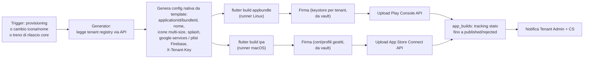

# 27 — Sistema White Label (progettazione tecnica)

## 1. Decisione architetturale chiave: cosa è compilato, cosa è runtime

| Elemento | Dove vive | Effetto di una modifica |
|---|---|---|
| Bundle ID / Application ID | Compilato (immutabile dopo la prima pubblicazione) | n/a |
| Nome app sotto l'icona, icona, splash nativa | Compilati nella build | Richiede nuova build + review store |
| Logo in-app, palette colori, tema completo, testi, tagline | **Runtime** da `GET /app/config` | Effettivo in minuti (cache `config_version`) |
| Catalogo, staff, orari, contenuti | Runtime (API dati) | Immediato |
| Feature flag di piano | Runtime | Immediato |

Questa separazione (criticità A2/D2 di [20-analisi-critica-fase1.md](20-analisi-critica-fase1.md)) riduce i rebuild ai soli casi: prima pubblicazione, cambio icona/nome, aggiornamento del motore Flutter (3-4 treni l'anno).

## 2. WhiteLabelConfig (contratto runtime)

Servito da `GET /api/v1/app/config` con ETag/`config_version`:

- identità: app_name, tagline, logo URL (CloudFront), immagini
- tema: token completi del design system (colori primari/secondari/superfici/stati, raggi, tipografia scale) — il design system Flutter consuma **token**, non colori sparsi
- comportamento: lingue disponibili, sedi, finestre di prenotazione, cutoff cancellazione, modalità conferma (auto/approva)
- feature flag: waitlist, recensioni, pagamenti…
- stato tenant: `active` / `suspended` / `terminated` + messaggio — l'app gestisce gli stati non attivi con schermata di cortesia (criticità C2)
- legal: URL privacy policy e termini (generati per tenant)

Il client cachea la config e la rinnova a ogni avvio (revalidation ETag) e su push silente `config_updated`.

## 3. Pipeline di build per-tenant

- **Convenzione bundle id**: `<reverse-domain-piattaforma>.t<tenant-shortcode>` — generato e riservato al provisioning, mai riusato
- **Asset**: dalla sorgente caricata dal tenant (logo/icona master) il backend genera tutte le varianti richieste (icone adaptive Android, set iOS, splash multi-densità) con validazione automatica (dimensioni minime, margini sicuri, contrasto)
- **Parallelismo**: build indipendenti per tenant, coda `builds` con limite di concorrenza per costo runner (i runner macOS sono la risorsa scarsa: pool dimensionato sui treni di rilascio)
- **Treno di rilascio core**: rebuild massivo batched (es. 200 build/giorno) con canary (prima i tenant interni di test, poi fasce progressive)

## 4. Tema dinamico nell'app Flutter

- Il package `white_label` espone il tema costruito dai token della config; tutti i widget del `design_system` sono theme-aware
- **Primo avvio offline-safe**: la build incorpora uno snapshot della config al momento della build come fallback; alla prima connessione viene sostituito dalla config live
- Cambio tema senza riavvio (lo state management ricostruisce l'albero al cambiare della config)

## 5. App gestionale: non white label

Una sola app "gestionale" pubblicata col brand della piattaforma serve **tutti** i tenant: il login determina tenant e ruolo. Razionale: dimezza le build, è pienamente conforme alle policy store (è un singolo prodotto B2B), e gli operatori non hanno bisogno del brand del salone sulla propria app di lavoro. La dashboard web resta disponibile per le attività di configurazione complesse ([31-dashboard-design.md](31-dashboard-design.md)).

## 6. Strategia store e conformità policy (rivede la Fase 1)

| Piattaforma | Piano Base | Note |
|---|---|---|
| **Android / Play Store** | Inclusa: app per-tenant pubblicata da account developer della piattaforma | Policy Play su app "ripetitive": mitigata con contenuti store reali per tenant (descrizione, screenshot generati dal catalogo reale, contatti propri); rischio residuo monitorato |
| **iOS / App Store** | Due percorsi: (a) account Apple Developer **del tenant** (Apple lo richiede esplicitamente per app pubblicate "per conto di un cliente": guideline 4.2.6/4.3 — le app template devono essere pubblicate dall'account del cliente finale del template) con onboarding assistito; (b) add-on "iOS managed" dove fattibile | Il costo account Apple (~99 USD/anno) è esplicitato nel contratto; il supporto alla creazione account è parte della fee di attivazione |

Conseguenza commerciale (da validare in Fase 0, vedi [20-analisi-critica-fase1.md](20-analisi-critica-fase1.md) C1): la promessa contrattuale distingue "app Android inclusa" e "app iOS con account a tuo nome, attivazione guidata inclusa". La pagina web di prenotazione (servita dal backend, stessa API) è il canale di cortesia per chi non installa l'app.

## 7. Ciclo di vita dell'app alla cessazione del tenant

1. Tenant `suspended`: l'app mostra schermata "servizio momentaneamente non disponibile" (config endpoint risponde anche per tenant sospesi, con payload minimo)
2. Tenant `terminated`: config endpoint risponde `terminated` con messaggio definitivo; rimozione dell'app dagli store entro 30 giorni; i clienti finali con appuntamenti futuri vengono notificati prima della terminazione
3. Gli asset di branding vengono cancellati da S3 secondo retention ([14-strategia-sicurezza.md](14-strategia-sicurezza.md) §9)

## 8. Anteprima live in dashboard

L'anteprima del branding in dashboard ([31-dashboard-design.md](31-dashboard-design.md)) è un **render web degli stessi token di tema** (design system replicato a livello visivo) su mock di schermate chiave: home, catalogo, dettaglio prenotazione. Non richiede build: consuma lo stesso WhiteLabelConfig in modalità bozza (`POST /manage/brand/preview`).
