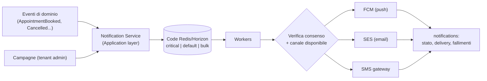

# 29 — Sistema Notifiche (progettazione tecnica)

## 1. Architettura

Principi:
- **Astrazione canale**: interfaccia unica `NotificationChannel` con implementazioni FCM/SES/SMS — nessun lock-in nel dominio (criticità A5)
- **Decisione canale a runtime**: push se esiste device token valido; fallback email; SMS solo se abilitato (costo) e configurato dal tenant
- **Consenso prima dell'invio**: le notifiche transazionali (conferme, promemoria) viaggiano su base contrattuale; quelle marketing richiedono opt-in verificato al momento dell'invio (non al momento dell'accodamento — il consenso può cambiare nel frattempo)

## 2. Template e localizzazione

- `template_code` + payload variabili; rendering per canale (push: titolo/corpo breve; email: layout brandizzato col tema del tenant; SMS: testo essenziale)
- Localizzazione nella lingua del destinatario (customer.locale), non del tenant
- Template personalizzabili per tenant (fascia Pro) con variabili whitelisted — l'input del tenant è sanificato (no injection nei template)

## 3. Promemoria: job ritardati per-appuntamento (rivede il Flusso 6 di Fase 1)

- Alla conferma di un appuntamento vengono **schedulati job ritardati individuali** (uno per soglia: es. -24h, -2h) con chiave di idempotenza `reminder:{appointment_uuid}:{soglia}`
- Su riprogrammazione/cancellazione: i job esistenti vengono invalidati (il job verifica all'esecuzione che l'appuntamento sia ancora confermato e che l'orario corrisponda — guard di coerenza, robusta anche se la cancellazione del job fallisce)
- Vantaggi sul polling a finestre: nessun promemoria perso a cavallo di finestre, nessun doppio invio multi-worker, carico distribuito
- Rete di sicurezza: un job di riconciliazione orario verifica che non esistano promemoria dovuti e non inviati (alert se ne trova)

## 4. Push multi-app: strategia Firebase

Problema (criticità D3): ogni app white label iOS/Android è un'app distinta che va registrata su un progetto Firebase; un progetto ha limiti pratici sul numero di app registrabili.

Disegno:
- **Pool di progetti Firebase** gestiti dalla piattaforma (provisioning via API amministrativa Google); mapping `tenant → firebase_project / firebase_app_id` nel tenant registry (`app_builds.firebase_app_id`)
- La pipeline di build genera e inietta il file di configurazione Firebase corretto per ciascuna app
- L'invio FCM usa le credenziali del progetto a cui l'app appartiene (cache delle credenziali per progetto nel Notification Service)
- L'**app gestionale** (unica) sta su un progetto Firebase dedicato e stabile
- Per iOS: chiave APNs caricata per progetto Firebase; con account Apple del tenant ([27](27-white-label-tecnico.md) §6) la chiave APNs è del tenant — passo previsto nell'onboarding assistito

## 5. Campagne broadcast

- Creazione → risoluzione segmento (query su customers + consents) → **chunking** in batch di invii sulla coda `bulk`
- Quota mensile per piano verificata alla creazione e all'invio
- Throttling: i batch di un tenant non saturano i worker (fairness per-tenant, [28](28-multi-tenant-tecnico.md) §7)
- Tracciamento: contatori invii/consegne/fallimenti per campagna; eventuali prenotazioni attribuite (finestra di attribuzione 72h, best effort)

## 6. Gestione token e igiene

- Token FCM registrati/aggiornati da `PUT /me/devices`; un token per device, deduplicato
- Feedback FCM (token invalidi/unregistered) ⇒ pulizia automatica dei device stale
- Apertura push tracciata dal client (deep link → schermata pertinente: dettaglio appuntamento, campagna)

## 7. Affidabilità

- Retry con backoff esponenziale per fallimenti transitori; dead-letter queue con alert oltre soglia
- Nessuna notifica persa per crash: lo stato (`notifications.status`) avanza solo a invio avvenuto; i job sono idempotenti per `notification_id`
- Rate limit verso provider esterni (SES sending rate, quote FCM) gestiti dal worker con budget per canale
