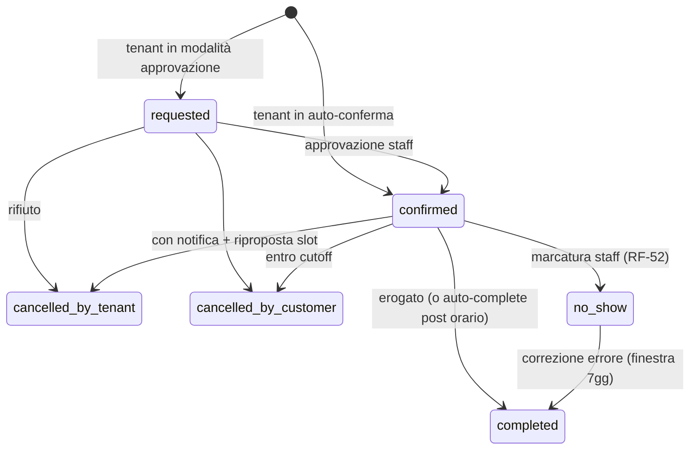

# 30 — Gestione Appuntamenti e Availability Engine

## 1. Responsabilità

Il context Scheduling possiede: calcolo disponibilità (read model), creazione/modifica/cancellazione appuntamenti (aggregato transazionale), macchina a stati, waitlist, gestione indisponibilità staff.

## 2. Tempo e fusi orari (regola fondante)

| Dato | Rappresentazione |
|---|---|
| Regole ricorrenti (orari sede/staff) | `TIME` locale + weekday + timezone IANA della **sede** |
| Eccezioni (ferie, chiusure) | date/ore locali della sede |
| Appuntamenti (istanti concreti) | `DATETIME` UTC, convertiti da/verso locale al bordo (API/UI) |

Il calcolo disponibilità per un giorno D: espande le regole locali nel giorno D **nella timezone della sede** (gestendo DST: i giorni da 23/25 ore sono corretti per costruzione), poi converte gli slot risultanti in UTC per il confronto con gli appuntamenti. Questo evita gli errori di "UTC ovunque" sulle ricorrenze (criticità B5).

## 3. Availability Engine

### Algoritmo (per richiesta: variante/i servizio, sede, staff opzionale, intervallo date)

1. Determina gli staff candidati (abilitati al servizio, bookable, della sede)
2. Per ogni giorno e staff: intervalli di lavoro = (schedule staff ∩ schedule sede) − eccezioni
3. Sottrae gli appuntamenti esistenti (+ buffer) dello staff → intervalli liberi
4. Genera gli slot di inizio con griglia configurabile (default: passo = 15 min) dove la **durata composta** (somma varianti richieste + buffer) sta nell'intervallo libero
5. "Nessuna preferenza": unione slot di tutti gli staff candidati; alla prenotazione si assegna lo staff con minor carico (bilanciamento)

### Caching (decisivo per RNF-01: p95 < 1s)

- Chiave: `t:{tid}:avail:{location}:{staff}:{date}:{duration_bucket}` — Redis, TTL 60s
- **Invalidazione su scrittura**: ogni evento che muta la disponibilità (prenotazione, cancellazione, modifica orari/eccezioni) invalida le chiavi del giorno/staff interessati (pattern delete per prefisso)
- Il TTL breve limita comunque la staleness residua; lo slot mostrato è sempre riverificato in transazione alla prenotazione (la cache non è autorità)
- Carico previsto: l'endpoint availability è ~10× le prenotazioni; con cache hit ratio atteso > 80% il costo DB resta lineare con le scritture, non con le letture

## 4. Prenotazione atomica (RNF-20)

Sequenza dentro **una transazione MySQL** (isolation: REPEATABLE READ di default InnoDB):

1. Risoluzione e validazione input (varianti attive, staff abilitato, dentro booking window, cutoff ok)
2. `SELECT ... FOR UPDATE` sugli `appointment_items` attivi dello staff nell'intervallo candidato (lock sull'intervallo tramite indice (tenant_id, staff_member_id, starts_at_utc))
3. Verifica overlap dell'intervallo richiesto (incluso buffer) contro le righe lockate; se conflitto ⇒ rollback, errore `slot_unavailable` (409)
4. Insert `appointments` + `appointment_items` (con snapshot); il vincolo UNIQUE(tenant_id, staff_member_id, starts_at_utc) è la rete di sicurezza finale contro start identici concorrenti
5. Commit ⇒ pubblicazione `AppointmentBooked` (outbox: l'evento è registrato nella stessa transazione e dispatchato post-commit)

Complementi:
- **Idempotency-Key** ([25-api-rest.md](25-api-rest.md) §6): retry di rete non duplicano
- **Soft-hold opzionale (UX)**: lock Redis di 120s sullo slot al momento della selezione nel client, per ridurre i 409 nei momenti caldi; è una cortesia, non una garanzia — la verità resta la transazione
- Gli stati `cancelled_*` escono dal computo overlap (filtro su status negli step 2-3 e indice parziale logico via colonna `is_blocking` derivata)

## 5. Macchina a stati

- Modalità per-tenant (`auto_confirm` | `request_approve`) — risponde alla criticità C3; le richieste `requested` scadono se non approvate entro N ore (auto-release dello slot, notifica al customer)
- Ogni transizione scrive `appointment_events` e pubblica l'evento di dominio corrispondente
- `completed` automatico a fine giornata per gli appuntamenti confermati non marcati (configurabile)

## 6. Prenotazione multi-servizio (criticità C4)

- Un appuntamento può contenere più item in sequenza (taglio + barba): l'engine cerca slot per la **catena di durate** (stesso staff, oppure staff diversi consecutivi se il tenant lo abilita)
- MVP: stesso staff, servizi consecutivi senza gap; multi-staff in fase successiva (la struttura dati lo supporta già)

## 7. Waitlist

- Iscrizione con preferenze (servizio, intervallo date, fascia oraria, staff opzionale)
- Su `AppointmentCancelled`: matching delle entry attive compatibili → offerta al primo in coda (push con deep link), `offer_expires_at` 30 min; scaduta l'offerta passa al successivo
- L'offerta **non riserva** lo slot (semplicità MVP): il primo che conferma prenota; il messaggio lo dichiara esplicitamente

## 8. Indisponibilità staff (Flusso 5)

1. Dichiarazione indisponibilità (intervallo) ⇒ `schedule_exceptions` + evento
2. Job identifica gli appuntamenti confermati impattati
3. Per ciascuno: notifica al customer con proposta di slot alternativi (stesso servizio: prima disponibilità altro staff abilitato, oppure stesso staff date successive)
4. Il customer riprenota self-service dal deep link; gli appuntamenti non riprogrammati entro la scadenza restano in evidenza nella dashboard staff per gestione manuale (telefonata)

## 9. Regole configurabili per tenant (riepilogo parametri)

| Parametro | Default | Dove |
|---|---|---|
| Booking window (giorni prenotabili in avanti) | 60 | location |
| Cutoff cancellazione/modifica | 24h | location |
| Granularità slot | 15 min | tenant |
| Modalità conferma | auto_confirm | tenant |
| Soglie promemoria | 24h | tenant (multiple in fascia Pro) |
| Auto-complete | fine giornata | tenant |
| Scadenza richieste pending | 12h | tenant |
